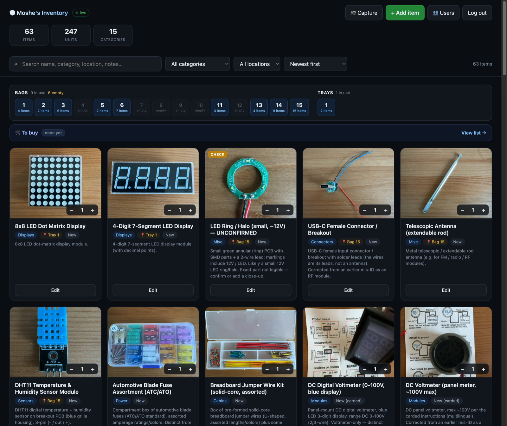
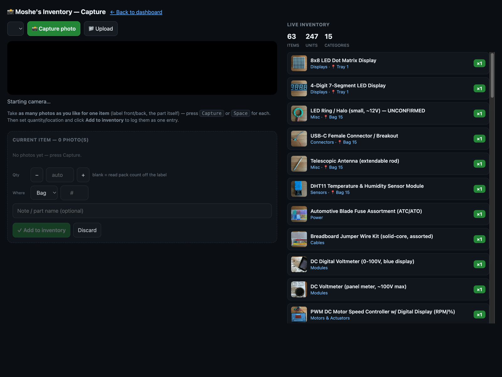
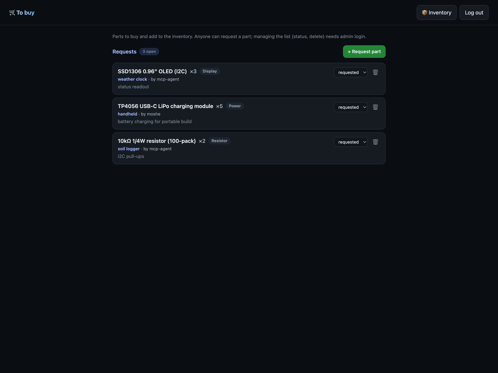

# my-inventory

**Landing page: [m-esm.github.io/my-inventory](https://m-esm.github.io/my-inventory/)**

A photo-driven inventory for small parts: electronics components, hardware,
fasteners, craft supplies, anything you keep in labelled bags or bins. Snap a
photo, set a quantity and a location, and it shows up on a live web dashboard you
can share read-only and edit after logging in.

It is deliberately tiny: **one Python file, standard library only.** No Node, no
pip, no database, no build step. The whole "stack" is `python3 server.py` and some
JSON files. It runs the same on a laptop or a $5 VPS.

The data in this repo (`data/inventory.json` + the photos in `captures/`) is a real
inventory of ~60 electronics parts, kept as a working example so the app renders
with real content out of the box.



## Why

Most parts-inventory apps want you to type part numbers. This one is built around
photos because a photo is the fastest honest record of "what is actually in this
bag." You capture the part (and the label, if you want), and that image is the
source of truth. Names and specs are optional metadata you fill in later, by hand
or with an LLM agent.

## Features

- **Photo-first capture.** Multiple photos per item from any webcam (a phone over
  macOS Continuity Camera works great). The first photo is the card thumbnail.
- **Public dashboard, private editing.** Anyone can view; only a logged-in admin
  sees the edit controls. Auth is off until you create the first admin, so local
  dev needs no login.
- **Search, filter, and a bag/bin map.** Filter by category, location, or free
  text. A storage map shows which bags are in use.
- **Duplicate handling in the UI.** When you add a part you already have, the app
  surfaces a duplicate card so you can add to the existing stash, set a new count,
  or file it as a separate bag. No silent double entries.
- **"To buy" list.** A separate wishlist of parts to purchase, with a public create
  endpoint so an agent (or a collaborator) can request a part with no credentials.
- **Agent-friendly.** A read-only [MCP server](mcp_server.py) exposes search,
  summary, item photos, and the one public write (`request_purchase`). An optional
  bridge lets an LLM identify uploaded photos and write back specs.
- **Safe by default.** Atomic writes, one-step `.bak` files, a guard against
  zeroing out a non-empty inventory, and a backup script.

## Screenshots

| Capture | To buy |
|---|---|
|  |  |

## Quick start

```bash
git clone https://github.com/m-esm/my-inventory.git
cd my-inventory
python3 server.py
# open http://localhost:8770/dashboard
```

That's it. No dependencies. Tested on Python 3.9+.

- **Dashboard:** http://localhost:8770/dashboard
- **Capture:** http://localhost:8770/capture
- **To buy:** http://localhost:8770/buy

Change host/port with `INVENTORY_HOST` / `INVENTORY_PORT`.

### Create an admin (to enable editing)

While no admin exists, the app is fully open (handy for local use). To lock down
editing, create an admin either in the browser (the **Set up admin** prompt on the
dashboard) or on the CLI:

```bash
python3 server.py adduser yourname admin   # prompts for a password (hidden)
python3 server.py users                     # show users / auth state
```

Passwords are stored salted-SHA256 in `data/users.json`, which is gitignored. Basic
Auth is base64, not encryption, so put it behind HTTPS for real use (see below).

## How it works

```
your phone/webcam ──capture──> server.py ──> captures/cap-<ms>.png
                                   │
                                   ├─ data/inventory.json   (the items)
                                   ├─ data/wishlist.json    (to-buy list)
                                   └─ public/*.html         (the dashboard UI)
```

The browser grabs frames with `getUserMedia` and POSTs them to the server, which
saves a PNG per frame and a small JSON sidecar per confirmed item. The dashboard
polls the JSON APIs and re-renders. Identification (turning a photo into a
name/category/specs) is optional and can be done by hand in the edit modal or by an
LLM agent watching for new sidecars. See [CLAUDE.md](CLAUDE.md) for the full
architecture, data model, and API table.

## Deploy

The app is one stdlib server, so deployment is "run it behind a TLS proxy." Two
ready paths live in [`deploy/`](deploy/):

**Docker + reverse proxy**

```bash
cp deploy/admin.env.example deploy/admin.env   # set ADMIN_USER / ADMIN_PASS
# edit docker-compose.yml: set your domain in the Traefik label
docker compose up -d --build
```

**systemd + Caddy (auto-HTTPS)**

```bash
export VPS_HOST=your.server.ip
./deploy/deploy.sh                              # rsync code + data, restart service
# on the server: install deploy/inventory.service and deploy/Caddyfile
```

All deploy/sync/backup scripts read `VPS_HOST` / `VPS_USER` / `VPS_PATH` from the
environment; nothing is hardcoded. `deploy.sh` and `sync*.sh` never overwrite the
server's `users.json`.

## MCP server (optional)

`mcp_server.py` is a stdlib MCP server that lets an LLM agent query the inventory
and request purchases:

```bash
INVENTORY_URL=http://localhost:8770 python3 mcp_server.py
```

Tools: `search_inventory`, `inventory_summary`, `list_all_items`, `get_item_images`,
`list_wishlist`, and `request_purchase` (the one public write).

## Data and backups

- `data/inventory.json` — the items (tracked here as the example).
- `captures/*.png` — item photos (the example photos are included).
- `data/users.json`, `data/*.bak`, `data/pending.json`, `data/wishlist.json` — local
  / secret state, gitignored.
- `scripts/backup.sh` pulls `data/` + `captures/` from a running server to a local
  folder (timestamped, zipped, read-only, pruned). Schedule it with cron or launchd.

## Contributing

Issues and PRs welcome. See [CONTRIBUTING.md](CONTRIBUTING.md). The whole point is
that it stays small and dependency-free, so changes that add a framework or a build
step are a hard sell.

## License

[GPL-3.0](LICENSE). You can use, modify, and redistribute it; derivative works must
stay open under the same license.
